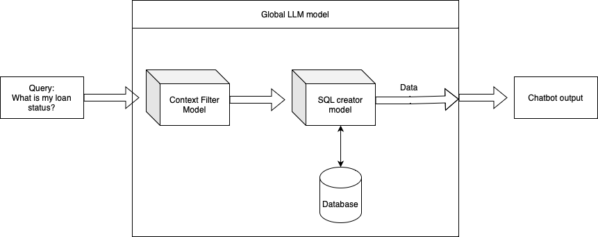

# Chatbot Clutch

### Considerations

In this project, I am using my personal computer, my goal was to made a MVP and I had to use commercial licensed models and with no data leaking. All the model/functions choices were made from those considerations.

### Poetry environment 
To avoid package conflicts and to ```pip install``` all the packages, I created a poetry env. To connect to the environment, run:
````
$ poetry install
$ poetry shell
````

# Project

### Data processing
In the part of the project, I  

1. Read all the xlm files and concatenate (in data/raw/*) them in a data frame.
2. Also generated more data for a better testing.
3. Saved the data in data/processed.
4. Created a sqlite3 database in data directory as well.

All this code is in a notebook in notebooks/data_manager.ipynb

### Architecture



The architecture of the model consists in 3 main parts

###### 1. Context filter

In this part of the model, it reads the client query and check if it's in the questions tagged as okay to answer or not, in the following way:

- The query is embedded using a local bert model (so no data leaking)
- Calculate the cosine similarity between the query and all the questions
- if the one (or more) cosine similarity is greater than a threshold (called similarity_threshold, and chosen to be 0.75) we go to the next step, otherwise it says it's impossible to answer the question (which means it's out of loan context)
- We see if the most similar phrase (or phrases) if okay to answer or not
- In case of several most similar questions, we use the mean of the scores (1=can answer, 0=cannot answer); if bigger than a threshold (boolean_threshold = 0.6), we go to the next part of the model. Otherwise, we cannot answer the question (context to avoid). 

For more information, check src/context_filter_llm_model.py and notebooks/test_for_context_filter_llm_model.py

###### 2. SQL LLM Model

Here, we know we can answer the client query, so it's time to look for the information in the database.

I choose the simplest way to do this. 

Since we only have one table in the database, and only some columns access, I choose to a LLMChain from langchain to create the queries and to connect to the database.

The LLM model used was "ggml-model-gpt4all-falcon-q4" since it's small enough for local running (4B parameters), have commercial use (so it can be reclicated in the future work) and is the best overall small model (https://gpt4all.io/index.html).

So we create the sql query and run the query in the database.

For more information, check src/sql_query_llm_model.py and notebooks/test_for_sql_query_llm_model.py

### Chatbot model

This part of the project is not working very well to answer questions about data, only general question. The same model of the sql_query_llm_model works really good for a chatbot.

Read the Future Work session to see how to solve the problem.


# Future work


