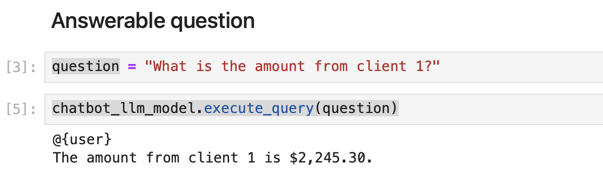

# Chatbot Clutch

### Considerations

In this project, I am using my personal computer, my goal was to made a MVP and I had to use commercial licensed models (since in the future we will use a commercial licensed model) and with no data leaking (for obvious reasons). All the model/functions choices were made from those considerations.

### Poetry environment 
To avoid package conflicts and to ```pip install``` all the packages, I created a poetry env. To connect to the environment, run:
````
$ poetry install
$ poetry shell
````

### To verify the functionality

Read all the notebooks/test_for_chatbot_llm_model.ipynb files.

# Project

### Data processing
In the part of the project, I  

1. Read all the xlm files and concatenate (in data/raw/*) them in a data frame.
2. Also generated more data for a better testing.
3. Saved the data in data/processed.
4. Created a sqlite3 database in the data directory as well.

All this code is in a notebook in notebooks/data_manager.ipynb

### Architecture


The architecture of the model consists in 3 main parts

###### 1. Context filter

In this part of the model, it reads the client query and check if it's in the questions tagged as okay to answer or not or if it's completely out of context of loan, in the following way:

- The query is embedded using a local bert model (to avoid data leaking)
- Calculate the cosine similarity between the query and all the questions
- if the one (or more) cosine similarity is greater than a threshold (called similarity_threshold, and chosen to be 0.6) we go to the next step, otherwise it says it's impossible to answer the question (which means it's out of loan context). If not, it's considered out of context question.
- We see if the most similar phrase (or phrases) are answerable or not.
- In case of several most similar questions, we use the mean of the scores (1=can answer, 0=cannot answer); if bigger than a threshold (boolean_threshold = 0.6), we go to the next part of the model. Otherwise, we considere non answerable. 

For more information, check src/context_filter_llm_model.py and notebooks/test_for_context_filter_llm_model.py

###### 2. SQL LLM Model

Here, we know we can answer the client query, so it's time to look for the information in the database.

I choose the simplest way to do this. 

Since we only have one table in the database, and only some columns access, I choose to a LLMChain from langchain to create the queries and to connect to the database.

The LLM model used was "ggml-model-gpt4all-falcon-q4" since it's small enough for local running (4 Billion parameters), have commercial use (so it can be reclicated in the future work) and is the best overall small model (https://gpt4all.io/index.html).

So we create the sql query and run the query in the database.

For more information, check src/sql_query_llm_model.py and notebooks/test_for_sql_query_llm_model.py

### 3. Chatbot model

This part of the project get the question and answer it or not depending of the type of question.

Here we have 3 categories:

1. Answerable questions: We can answer the question normally looking in the database:




2. Not answerable question: We recommend them to contact a senior lending officer:


3. Out of context question: Avoid answer the question


For more information, check src/chatbot_llm_model.py and notebooks/test_for_chatbot_llm_model.py

# Future work

Since it's a small project, it's not optimal, even if it's functional.

We have several things to do in the future to optimize it.

###### 1. Context filter

- Here, at every question the client make, we calculate all the embeddings and the distances. In a deployed model, the llm model will be fixed. So we can already calculate all the embeddings before to be more optimal.
- Also the threshold must be tested better. I choose similarity_threshold=0.6 just because we have to change a little the format of the query, like "what is the status of the client 1?", so it deviate the context. In the real life, the client who made the query already have it's ID in his/her login.

###### 2. SQL LLM Model

The most optimazable part of the project.

- I choose to use a simple LLM chain to create the query, but it's doesn't have direct access to the database, so the sql queries are not very optimal.
Instead, we can use SQLDatabaseChain also for langchain, but it's not very simple to run locally without access to OPENAI (https://github.com/langchain-ai/langchain/pull/3636). Also a better method is SQLDatabaseToolkit also from langchain I cannot found any documentation for running it locally.
- Both of those methods also generate directly the final answer. So probably no need of the chatbot model part.

###### 3. Chatbot model

- This part as said above, can be merged to the SQL LLM model.


###### Global of the project

- 3 LLM models are charged for each part of the project. Just one model can be used for all the 3 parts. It will save a lot of local and ram memory. Also it will be a a lot faster.
- In a production project, it's possible to use a bigged llm model, a 7 billions parameters is definitely not the best one. 
- A benchmarking of models is also desirable.
- All the manipulations are made in pandas, in the future other frameworks can replace it.
- Security: We can ask questions about all the clients, it's necessary to create permissions to access just the client data. Also it will make it the query simpler, since we won't need to specify the customer.


